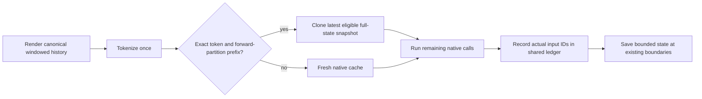

# Conversation-history cache: implementation and evidence

The isolated patch adds an explicit `history` strategy that can retain intermediate conversation state while preserving the ordinary runner's forward schedule. It remains experimental. Qwen3.5 `auto` still resolves to `none`, and the registry's equivalence field remains null. Real-checkpoint acceptance is pending normal access to the model lock.

Worktree: `/private/tmp/codex-history-cache-01a079ee`  
Branch: `codex/history-cache-equivalence`  
Base: `3922b0ba5a59ed9681d1b47e1590e387d7eacfed`  
No integration into the primary checkout is part of this patch.

## Why the existing snapshot strategy diverges

`SnapshotCache.prepare()` computes the system/task prefix in a separate model call, then gives the suffix to the generator. This changes execution even on turn zero, before any snapshot restoration. Its `commit()` does nothing, so intermediate assistant/tool history is never promoted to the saved prefix.

Claude's completed native comparison is at:

- `/Users/daniel.tipton/Desktop/An app/research/records/ARM-A-DIVERGENCE-2026-09-07/cache/cache_runner_paths.json`
- Its driver: `scripts/cache_runner_paths.py` in that checkout.

Across eight step-zero prompts, ordinary string input and ordinary token-array input give identical generated tokens and initial log probabilities. Repeating the ordinary call is also identical. Splitting at the snapshot prefix changes initial log probabilities in all eight cases, by a maximum absolute 0.375–0.875. Within the first 24 tokens, search first diverges at position 22, list at position 4, and ledger at position 0. Ledger's ordinary first-token winning margin is zero; the split run's margin is 0.125. Converting the sampling logits to float32 does not remove those divergences.

This supports a native schedule problem, rather than a tokenizer-input or sampler-precision problem. It does not locate the first differing native layer or prove restoration correct. The earlier `cache_split_diagnostic.json` runs through manual architecture-view operations in float32, so its small differences and zero reported restore error do not certify the ordinary native path.

The model has both attention KV state and recurrent convolution/matrix state. A correct mathematical split can still change finite-precision arithmetic when input shapes and kernels change. The KV state setter already reconstructs its offset; a missing KV offset has not been established as the existing bug.

## Design

### One authority for actual model inputs

`forward.py` introduces `ForwardLedger` and immutable `ForwardPass` entries. The ledger records the exact input IDs, absolute offset and partition of every actual model call. Emitted tokens have a separate list and never advance the forward cursor. This includes MLX's decode lookahead, where a token can be forwarded before it is yielded.

Both `HistoryCache` and live-lens `CaptureSession` use this authority. Capture retains its no-reuse requirement, existing record schema and replay behavior. The cache checks all native attention offsets against the ledger before and after each call. Conflicting IDs, discontinuous positions, foreign cache objects and context overruns fail explicitly.

### Save complete native state at existing boundaries

The cache observes the native model through a delegating wrapper. It saves snapshots at prefill boundaries and at turn completion, without adding a forward split merely to obtain a snapshot. Snapshots contain complete, evaluated native cache objects, including recurrent matrices, convolution history, attention K/V, offsets and padding metadata. Restoring a snapshot clones it again so later mutation cannot corrupt the saved state.

Retention is episode-local and bounded to four snapshots and 512 MiB of stored cache state by default. Budget eviction retains an early rollback anchor where possible and rotates the other slots. A state larger than the budget is not retained. This bound excludes the live working cache, temporary restore copy and Python bookkeeping. Weights and adapters must remain unchanged for the lifetime of an episode cache.

### Reuse requires matching tokens AND matching computation

On each turn, the existing renderer produces the canonical prompt. `prepare()` discards snapshots whose token prefix no longer matches, then selects the latest snapshot whose entire saved forward partition is an exact prefix of the next ordinary native prefill partition. If none qualifies, it recomputes.

The default partition is the installed generator's 2,048-token prefill chunks, with the final prompt token reserved for a separate call. The strict comparison harness leaves the reference generator on its installed default, so changing that library default cannot silently certify our constant.



This matters because assistant history is re-rendered from parsed notes/actions, and old tool observations are replaced by hidden-result stubs. Raw generated IDs cannot be assumed to equal the next canonical prompt. When a past observation changes, every state depending on it must be discarded; retaining that state would make hidden information available to the model.

### Practical limitation: short growing conversations may gain nothing

Retaining a generation-end state does not make it eligible for the next bulk prefill. A token-by-token generated suffix generally has a different forward partition from a later bulk prompt. Under the user's bit-identical requirement, this patch does not substitute one for the other.

All 64 captured agentic pilot turns have prompts shorter than 2,048 tokens. They therefore provide useful native recomputation controls but no guaranteed cross-turn reuse for growing prompts. The long ledger fixture has four later prompts of 2,269, 2,362, 2,455 and 2,548 tokens that share a complete native chunk. That provides real conversation-history reuse coverage.

A smaller fixed prefill cadence or a fully incremental transcript could offer more reuse. Both change the numerical baseline, and changing the transcript also changes the task's observation-hiding semantics. Neither is silently introduced here. A different cadence must independently pass check B against the existing runner; agreement between cached and uncached execution under the new cadence is insufficient.

## Acceptance checks

The harness consumes frozen prompt and continuation token IDs. It teacher-forces the continuation, so both arms encounter exactly the same history even when their greedy predictions would differ.

| Check | Reference | Pass condition |
| --- | --- | --- |
| A: restoration | Fresh native state replaying the candidate's exact recorded forward partition | Bit-identical boundary-last logits for newly executed calls and complete final logical state; actual reuse must occur somewhere in the corpus |
| B: baseline preservation | Installed native generator from the full prompt using its ordinary default cadence | Bit-identical logits at every generation decision and complete final logical state |

Finite values, shape, dtype and byte identity are required. Argmax agreement, numerical tolerance, rounded errors and task success cannot override a failure. A corpus with no actual reuse is inconclusive for A. Every control episode must still have zero numerical discrepancies.

Unused KV allocation capacity is excluded from logical-state comparison. The ordinary prefill does not evaluate the full vocabulary projection for every prompt token, so the harness does not materialize that discarded matrix. Check A observes the last query at each executed boundary; B covers all actual generation decisions. No attestation of every discarded prefill logit is claimed.

Reports retain exact partitions, token/corpus hashes, errors, first differing greedy positions, winning margins, logical state hashes, model/adapter declarations, source hashes and hashes of installed MLX-LM sources and MLX binaries. The CLI exits unsuccessfully if either gate is not passed and never edits registry verification fields.

## Verification and frozen inputs

Tiny tests use the installed Qwen3.5 implementation with small randomly initialized weights, including float32, bfloat16 and 4-bit variants. Negative controls corrupt a snapshot, introduce a shape-dependent state change, and change a nonwinning logit by one bit. Tests also cover rewritten observations, exact forward accounting, native streaming and early stopping, metadata isolation, offsets, memory limits, explicit strategy resolution and capture's no-reuse rule. Tiny-model results are not checkpoint certification.

Final regression result: **191 passed in 5.07s**. Changed-file Ruff checks and `git diff --check` pass. The recorded test and lint output is in `research/records/HISTORY-CACHE-2026-09-07/`.

A GPT-6 Astra source reviewer found no material correctness defect in the implementation. Its request to clarify the discarded-prefill-logit boundary is incorporated above.

The fixed corpus is:

`research/records/HISTORY-CACHE-2026-09-07/fixed-history-native-reuse.json`

SHA-256: `1b79bf538755aacb91b9f8bf9459ee22bdc8f4423319949f3920a026ddafa2ca`

It contains 19 episodes and 76 turns: all completed agentic pilot turns, all eight supplied native step-zero controls, and four later ledger turns selected by shared-token structure before this patch's model comparisons. Pilot emissions retain their recorded token IDs. The later ledger continuations are explicitly declared teacher-forcing IDs obtained by locally retokenizing the first 24 tokens of existing raw output; they are not presented as the original generator's token segmentation. Source hashes and selection rules are embedded in the corpus. Preparation loads tokenizer assets only.

## Checkpoint handoff

The queue log records successful pilot and native-comparison exits, ending at 16:04:28 Melbourne time. A subsequent base evaluation acquired the primary model lock at 16:21:04 (PID 10458). No checkpoint has been loaded for this patch while that evaluation owns the lock, and no lock or process has been removed or stopped.

`run_acceptance.py` routes the unchanged repository model-lock mechanism to the primary checkout's lock path. This is necessary because an isolated worktree otherwise derives a different lock path. It retains normal acquisition, process checks, refusal and process-lifetime release. It uses the installed local checkpoint cache offline and writes results only in this worktree.

Once the machine is available, run from the isolated worktree:

```sh
PYTHONPATH=src '/Users/daniel.tipton/Desktop/An app/.venv/bin/python' \
  research/records/HISTORY-CACHE-2026-09-07/run_acceptance.py \
  --model qwen35-4b --strategy history \
  --fixed-history research/records/HISTORY-CACHE-2026-09-07/fixed-history-native-reuse.json \
  --report research/records/HISTORY-CACHE-2026-09-07/base-acceptance.json
```

An adapter check must run serially in a separate process, adding `--adapter '/Users/daniel.tipton/Desktop/An app/outputs/agent-v2e-qwen35-4b/best-adapter'` and using a distinct report path. Do not clear a lock to make either command run. Passing is evidence for the loaded weights, installed runtime and fixed corpus only. Any registry/default change remains a separate decision after reviewing real-checkpoint evidence.

Speed has not been established. Snapshot copying can outweigh saved prefill, and the original divergent trajectories were different workloads. Evaluate performance only after correctness, on identical fixed inputs with reuse and snapshot costs included.
