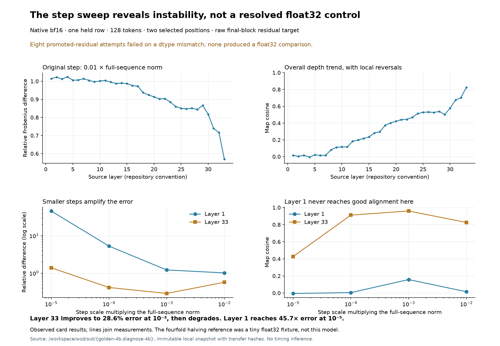

# Diagnosis: finite-step and finite-precision error remain entangled

**Recommendation: run a matched whole-float32 AD/FD control with a step sweep, initially on a small set of directional derivatives. Do not average more uncalibrated full bf16 maps.** The current evidence establishes that the native finite-difference instrument is inaccurate at the tested steps and strongly unstable at the small-step end. It does not establish that precision is the only cause, that float32 has passed, or that the model has a defect.

The D-CRO's canonical record is `research/records/WSD-GOLDEN-4B-2026-09-09/` at **c3abdbe**. All eight reports and producer files copied from the card match that commit byte for byte (`CANONICAL.json`). The data were read without touching a run or loading a model. This record is a new analysis; the original evidence is unchanged.

## What is established

| step scale | layer 1 relative error | layer 33 relative error |
|---:|---:|---:|
| 0.01 | 1.01423 | 0.56900 |
| 0.001 | 1.21444 | 0.28621 |
| 0.0001 | 5.28802 | 0.41280 |
| 0.00001 | 45.73407 | 1.39071 |

Layer numbers here are the repository convention: these are source blocks 0 and 32, targeting block 33's output. One held row, index 39, is truncated to 128 tokens. Positions 8 and 127 were **deliberately selected**, rather than being the only valid positions in the text. The map averages over those source positions and sums the selected target positions. These measurements are a thin instrument check, not a corpus lens fit or a sliding-window contrast.

Shrinking the step makes the early-layer estimate much worse. Near the target, a better intermediate step is visible, but even its best observed error is 28.6%. This supports competing finite-step and arithmetic errors. The smallest tested steps are unusable; no accurate interval has been demonstrated. Four tested scales do not prove that no interval can exist elsewhere. Both forward and central differences amplify evaluation error as `1/h`; the source code, rather than that growth alone, establishes that this estimator is central.

**The promoted-float32 attempt is not a float32 result.** All eight cells raised `expected mat1 and mat2 to have the same dtype`: the script inserted a float32 residual into bf16-weight blocks. No numerical comparison was produced. A later coherent float32 control, if run, needs its own record. An execution error must not take the schedule's scientific branch “float32 still disagrees.”

## Corrections that change the interpretation

**The endpoint is a residual, not logits.** Both operands read the final decoder block before final normalization and unembedding. Low-precision loss can occur there or earlier in the tail, but a claim specifically about output-token logits rounding to zero does not describe the measured quantity.

**The step is not locally 1%.** The code uses `h = 0.01 * ||H||F` over all 128 × 2560 entries, then adds that entire step to one coordinate at one selected position. Therefore

\[
h=0.01\sqrt{128\cdot2560}\,\mathrm{RMS}(H)
 =5.724334\,\mathrm{RMS}(H).
\]

That is an exact scale identity. It does not prove a nonlinear response or specify the affected coordinate's own magnitude, but it makes truncation/saturation a serious competing explanation. Sequence outliers and context length influence a coordinate perturbation under this rule. The actual original steps range from 101.568 to 8,817.745; this is not an absolute step of 0.01.

**The 3.9 ratio is a fixture result.** The plan at b141fef explicitly identifies a tiny decoder: width six, float32, synthetic rows, CPU. It is not the same Gemma checkpoint and tokens on the laptop. It cannot diagnose the laptop lens precision. The old MLX source separately promotes its tail and primals to float32, which is valid source evidence; it also reads same-position derivatives, unlike the present source-mean/target-sum reduction. An as-run lens needs its own arithmetic and estimator provenance before this test can bound it.

**Repetition at exactly zero proves reproducibility.** It does not establish that bf16 autograd is an error-free mathematical reference. Autograd applies chain rules to framework operations at computed intermediates; it does not differentiate the literal discrete bit-pattern function. That distinction is a known AD validation issue, not evidence against this implementation. [Hückelheim et al., 2024](https://doi.org/10.1002/widm.1555).

**Depth has more than one explanation.** Earlier sources traverse more operations; their scales, curvature and conditioning also differ. Raw residual maps include an identity route through residual additions, increasingly relevant near the target. Compare the full maps and the learned correction `J − I` before claiming the cosine trend specifically identifies rounding. The trend is not strictly monotone in the saved rows.

**Forward scheduling still needs a control.** The exact run uses 64 replicated forward rows, the FD primal comes from one row, and perturbed forwards use batches of 256. Existing fixture checks do not certify these schedules on the checkpoint. A no-perturbation replacement and same-batch comparison must precede attribution of the whole difference to finite differences. PyTorch documents that batched and sliced computations need not be bit-identical. [Numerical accuracy](https://docs.pytorch.org/docs/main/notes/numerical_accuracy.html).

## A more robust numerical model

Let `F` be the smooth tail with fixed numerical weight values, and let its arithmetic implementation be `F_p = F + eta_p`. Realized interventions are `x_plus = x + h*v + r_plus` and `x_minus = x − h*v + r_minus`. The central difference then contains four distinguishable contributions:

\[
D_{h,p}v-Jv
=O(h^2)
+\frac{\eta_p(x_+)-\eta_p(x_-)}{2h}
+\frac{J(r_+-r_-)}{2h}
+\text{higher-order terms}.
\]

Comparison against computed AD adds its arithmetic error; different base points or forward schedules add another term. No independence or zero-mean assumption is made about rounding. This is a diagnostic decomposition, not a fitted causal model of the eight measurements.

A useful local error envelope is `A h² + B/h + C`. It explains why “smaller” can initially help and then hurt. For a central difference of a smooth scalar function with bounded evaluation noise, the classical balance is proportional to `|f'''| h²/6 + noise/h`; step selection needs both curvature and evaluation accuracy. [Shi et al., 2022](https://doi.org/10.1137/21M1452470). Transformer rounding is structured, so that paper's bounds must not be inherited without checking their assumptions.

The single halving ratio cannot identify the terms. Normalize the current step to one and set `C=0` only for an illustrative counterexample. Taking `B/A=0.545159` yields exactly the observed ratio 1.152830. Pure truncation gives four; pure `1/h` error gives one half; a mixture gives the observed improvement without proving a plateau. `analysis.json` records this algebra as illustrative, not as a fitted noise level or a recommended step.

The early map can be described precisely without the label “nearly empty.” With relative error `r`, cosine `c`, and norm ratio `rho`,

\[r^2=1+\rho^2-2\rho c.\]

At layer 1, `r>1` gives a unique nonnegative solution: **rho=0.185178**, with only **0.00281684** of the reference along its direction in the least-squares projection. Thus the estimate at the original step is attenuated and misaligned. At tiny steps its norm/error instead explodes. Neither “empty” nor “a wrong map” describes the complete mechanism. Negative controls separated by worst-layer error verify rejection sensitivity, not estimator accuracy at every layer.

## Resolution

The detailed, bounded control is in [RESOLUTION-PROTOCOL.md](RESOLUTION-PROTOCOL.md). It freezes one function at a time, verifies the replacement boundary, compares AD with FD at matched precision, measures realized displacements, and sweeps fixed directions before full matrices. The existing exact/autograd implementation supplies the candidate sensitivity instrument; native finite-amplitude interventions test whether those sensitivities predict actual effects.

Whole-float32 weights and residuals must be coherent; casting only the captured tensor is insufficient. For an arithmetic control, cast the same stored bf16 weight values to float32, rather than silently loading different values. Record actual matmul precision and autocast: a float32 tensor declaration alone does not guarantee IEEE float32 multiplication.

If the matched float32 pair converges, that validates the tested local derivatives and supports a low-precision contribution. If it fails at one step, that does not exclude precision; check step convergence and the forward boundary. If no accurate interval emerges, use an explicit unresolved outcome. No claim of global soundness follows from one row and three layers.

## Reproducibility and source status

`analyze.py` rejects changed source hashes and model imports, verifies the finished logs and shared estimator metadata, and regenerates the CSV/JSON and PNG/SVG. `verify.py` checks data corruption, arithmetic identities and byte-identical reproduction. `SOURCES.json` and `CANONICAL.json` provide transfer and Git provenance. As-run scripts under `source/` are evidence and are never executed by this analysis.

The two open academic PDFs are downloaded under `source/papers/`, with source URLs and SHA-256. They supply numerical-analysis and AD methodology; neither is a study of this Gemma run. Source definitions are pinned at b141fef, and the canonical run is c3abdbe. This record's findings, mathematical model, implementation evidence and still-unexecuted controls remain separate.
