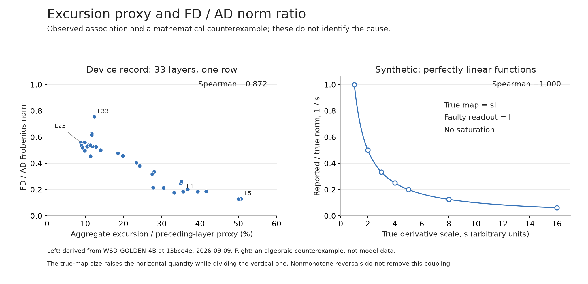

# Audit of the new saturation evidence

**Finding:** the numerical summaries at `13bce4e` reproduce. They establish an association and compressed saved maps, but do not identify saturation or exclude rounding. The matched whole-float32 AD/FD step sweep remains the next experiment. No additional full bf16 rows are justified by this audit.

This is a new analysis of `WSD-GOLDEN-4B-2026-09-09`, not an amendment to that source record. Input snapshots and hashes are in [SOURCES.json](SOURCES.json); [analysis.json](analysis.json) and [layers.csv](layers.csv) contain the reproduced figures. All empirical numbers below are **derived from the device record**, one row at 128 tokens with two selected positions. Synthetic examples are explicitly identified. There were no model imports, checkpoint loads, map downloads, or GPU operations.

## What the model record establishes

The reported Spearman correlation reproduces at **−0.8716577540**, and Pearson on logs at **−0.9270698881**. The norm ratio falls at **12 of 32** adjacent-layer steps, with the proposed excursion moving oppositely at **9**. None of those twelve transitions is an exact tie. Calling the three misses ties requires a declared, symmetrically applied band; none appears in the source. Adjacent layers are not independent replications.

The zero-response artifact reports **zero exactly-zero saved columns**. That excludes total disappearance of all aggregated components in any direction column at the original step. It does not measure the fraction of output components or individual source/target-position responses lost to rounding. The producer loads the saved maps and takes column norms; it does not inspect the paired forward outputs.

The artifact's `iff` rule is also too strong. Zero responses everywhere imply a zero aggregate, but nonzero contributions can cancel to a zero aggregate. Therefore the converse is false. This does not invalidate the observed zero count; it limits its interpretation.

**Synthetic rounding counterexample:** consider a linear map whose diagonal is 1 and whose off-diagonal entries are 0.49. With nearest-integer output rounding, central differences at zero with step 1 return identity. At dimension 256, every column survives, **99.61% of components are lost**, and the FD/reference norm ratio is **0.12677**. These are mathematical illustration numbers, not Gemma measurements and not a bf16 simulation. They disprove the inference that nonzero saved columns exclude severe rounding loss.

## Why the association is not a mechanism

Write `m = median exact-column norm`, `a = exact Frobenius norm`, `f = FD Frobenius norm`, and `T = the proposed target proxy`. The plotted quantities are

\[
X=\epsilon m/T,\qquad Y=f/a.
\]

The exact-map magnitude enters the two axes in opposite directions. In these records, the log correlation between `m` and `a` is **+0.9945246338**. Their product exposes the shared terms:

\[
XY=(\epsilon/T)(m/a)f.
\]

**Synthetic linear counterexample:** let every true tail be `F_l(x) = s_l x`, so its Jacobian is `s_l I`. Let an erroneous measurement path return `I` regardless of `s_l`. At fixed epsilon and target scale, `X` is proportional to `s_l`, while `Y=1/s_l`. Both correlations are **−1**, including arbitrary nonmonotone reversals. Every true function is linear; none saturates. This does not establish that the observed relationship is entirely an algebraic artifact. It establishes that the correlation cannot distinguish saturation from an incorrectly scaled instrument.

Nor is the proposed excursion a measured token displacement. The declared map averages selected source positions and sums selected target positions. For this causal two-position selection it is

\[
\bar J=\tfrac12(J_{8\to8}+J_{8\to127}+J_{127\to127}).
\]

A column predicts this aggregate tangent response, which can conceal cancellation. It is not the response of one selected position. The denominator, **77,938.59**, is a proxy derived from the preceding source layer's full-sequence norm divided by the square root of sequence length. It is neither a measured target-token norm nor necessarily the norm at either selected position.

Consequently **8.8%–50.7%** reproduces as an aggregate linear prediction divided by that proxy. It does not establish that any actual output moved by half its size. Even a correctly measured large linear prediction would not prove nonlinearity: a globally linear function has no finite neighborhood boundary.

The earlier geometry correction also stands: the original step equals **5.7243 global coordinate-RMS units**, not 5.7 times each affected coordinate's own magnitude. Constancy in global RMS units does not imply constant local step size or curvature across layers. See the [preceding diagnosis](../FD-NUMERICS-2026-09-09/README.md).

## Technique that resolves the ambiguity

The [existing resolution protocol](../FD-NUMERICS-2026-09-09/RESOLUTION-PROTOCOL.md) already specifies the required controls. This audit strengthens the reason to retain individual responses before aggregation; it adds no new full-map work package.

1. Verify that replacing a residual with its unchanged capture preserves the target output under the actual forward schedule.
2. At fixed layers, source positions and directions, compare autograd and central differences through the **same coherent float32 model**, with identical numerical weights, anchors and batch schedule. Sweep the step, beginning with a few directions at batch one rather than a whole map.
3. Save actual input displacements, individual target responses, rounding/unchanged fractions and Taylor remainders before reducing them. Compare measured response with that position's derivative prediction.
4. Keep the native bf16 comparison separate. If float32 recovers a useful derivative interval and bf16 does not, precision is implicated. If reducing the original step greatly improves float32 agreement, finite-step error is implicated. Both may be present. A remaining mismatch requires boundary, schedule or definition diagnosis.

Varying the step within one layer holds the reference-size denominator fixed and tests step dependence. A large response alone is insufficient; the observed change in the derivative estimate and its precision dependence supply the discriminating evidence. No claim that this must finish in three minutes, or must agree to machine epsilon on the real model, is made.

## Implementation and verification

`analyze.py` uses only Python's standard library. It checks every input digest, joins layer conventions from the recorded endpoint mapping, reproduces correlations and all transition signs, and verifies known-answer ranking, linear-coupling, rounding and cancellation examples. It does not independently regenerate the large saved maps: the zero-column values remain the source producer's measurements.

Run `python3 research/records/FD-SATURATION-AUDIT-2026-09-09/analyze.py` from this worktree. Optional `plot.py` uses Matplotlib and reads only the derived CSV/JSON. Independent read-only mathematical and source reviews reproduced the calculations and checked the conclusions. A read-only inventory of `/workspace/wsd/out` at **11:49:03Z on 2026-09-09** contained no new coherent-float32 output; this is an observation of that directory, not a statement about all activity on the card.
