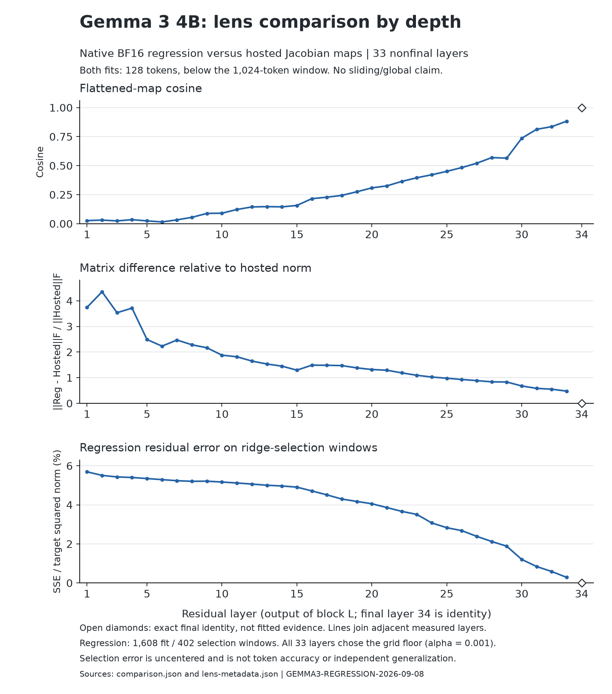

# Native Gemma regression fit and hosted-lens comparison

The all-layer native BF16 regression fit completed on 8 September 2026 in **487.77 seconds
(8 minutes 8 seconds)**, with **12.44 GiB peak MLX allocation** under its 14 GiB ceiling.
All 33 nonfinal maps were saved and passed hash, identity, dimensions and finiteness checks.
Layer 34 is identity by definition. The ordinary model window closed when the process exited.

## Finding

For this Gemma checkpoint and these fitting conditions, the regression maps and the hosted
Jacobian maps become more aligned toward the output. The trend is not strictly monotonic.
Their flattened-map cosine goes from 0.0266 at layer 1 to 0.3082 at layer 20 and 0.8830 at
layer 33. They are still distinct at layer 33: their Frobenius difference is 47.54% of the
hosted map's Frobenius norm. Exact identity at layer 34 is a boundary condition, not confirming
evidence. The full set of 33 measured layers is in [comparison.csv](comparison.csv).

| Residual layer | Map cosine | Difference / hosted norm | Regression selection SSE / target energy |
|---:|---:|---:|---:|
| 1 | 0.0266 | 3.7441 | 5.6913% |
| 10 | 0.0903 | 1.8785 | 5.1675% |
| 20 | 0.3082 | 1.3192 | 4.0558% |
| 30 | 0.7356 | 0.6774 | 1.2056% |
| 33 | 0.8830 | 0.4754 | 0.2873% |

The regression's selection residual error decreases substantially with depth. It is an
**uncentered energy-weighted error**, not a percentage of tokens predicted correctly, variance
explained around a mean, concept readability, or an independent generalization estimate. Large
residual-energy directions receive more weight; this run does not establish which directions
matter for individual token predictions. No comparison of token readouts was measured.

Every layer selected **alpha = 0.001**, the smallest value in the unchanged five-value grid.
This identifies the best permitted candidate, not an interior optimum or evidence that a smaller
penalty would be worse. The grid was not extended after seeing the result. All five candidate
errors and actual penalties remain in [lens-metadata.json](lens-metadata.json).

This is a **measurement of different instruments**, not a validation gate. Regression predicts
final residual values on a corpus; the hosted Jacobian lens approximates tail derivatives.
Objective, corpus and stored precision differ together, so this comparison cannot isolate the
cause of their disagreement. Nor does matrix cosine establish agreement on the residual
distribution or through the model's nonlinear final normalization and unembedding.

**Context caveat for every hosted-lens number:** its fit used 128-token sequences against a
1,024-token sliding window, so every windowed layer was fully causal during fitting. Our initial
regression also uses 128 tokens to match that context length. Neither this plot nor this fit
supports a sliding-versus-global attention claim. A fit above the window remains separate work.

## Technique, stated independently of this implementation

1. Freeze the source text, tokenizer assets, exact token sequences and split membership before
   reading fitted results. Tokenize the authorized WikiText-103 raw validation text once; cut
   consecutive, nonoverlapping 128-token windows. Hold every fifth one-based window for penalty
   selection. Discard only the final incomplete tail. This yields 1,608 fit windows (205,824
   positions) and 402 selection windows (51,456 positions), with 11 trailing tokens discarded.
   Fit and selection are neighboring windows of one text stream, not disjoint documents.
2. For every window, run one unpadded, uncached forward through the actual model. Read the residual
   after each complete decoder block, before final normalization. At each position pair the
   residual after block L with the residual after the final block at the same position. Include
   every position, including the single initial BOS. These are supplied prose tokens, not model
   continuations. No task/pilot observations or generated turns enter the regression.
3. Accumulate separate fit and selection sufficient sums for each nonfinal layer: X'X, X'Y and
   scalar sum(Y squared). Keep accumulation in float32 and release per-window activations after
   materializing the sums. No activation dataset is saved. This transfers to any implementation
   that can expose the same residual convention, but float32 accumulation order remains part
   of the numerical method.
4. For each layer solve W = (X'X + alpha * mean(diag(X'X)) * I)^(-1) X'Y, using a linear solve
   rather than explicitly forming an inverse, for alpha in [0.001, 0.01, 0.1, 1, 10]. Choose the
   first minimum selection SSE divided by selection target energy. Store J = W' so a row residual
   reads out as h J'. This penalty scales with the number of fit positions. Float32 sufficient
   sums can suffer cancellation; the reported SSE is preserved rather than clamped.
5. Compare maps in their common output-by-input convention. At every layer calculate both
   Frobenius norms, their flattened cosine, their difference divided by the hosted norm, and each
   distance from identity divided by sqrt(hidden width). Compute these reductions in float64
   from the stored arrays. Treat final identity as an explicit mathematical baseline. Preserve
   provenance differences rather than using agreement or disagreement as a correctness test.

The transferable result is that a successful value-prediction fit and a derivative-based lens
can have weak early-layer matrix alignment and stronger late-layer alignment in the same model.
The method exposes that difference without a second checkpoint load. It is currently a result
about **this Gemma fit**, not a fact established across transformers. A second model/independent
run and downstream readout measurements would be needed to extend that claim.

## Implementation and evidence

The run used branch `codex/gemma-lens-fitting`, registered at **e0e9fa6**, on landed base a584acd
plus corpus preparation 7db26d4. Explicit arguments were `--kind regression --model gemma3-4b-bf16
--residual-source native --layers all`. Native capture reads the model's own forward and avoids
the known hand-run mask defect. Its source is stamped in the artifact. The registered files were
unchanged at post-run verification. No Qwen work, dictionary download or scope composition was
started. The no-reuse strategy and ordinary shared model lock/window were used.

Four launch/provenance defects were repaired before loading: progress tried to treat the new
native-source string as a dictionary; token progress tried to treat it as a count row; corpus
setup treated a local model directory as a Hub repository; and the artifact identity overwrote
the checkpoint snapshot. The fixes preserve the existing computations while allowing this path
to run and retaining the exact checkpoint digest separately. The supplied BF16 registry entry
was absent in the inspected checkout, so this isolated branch records the authorized local
conversion explicitly. The shared checkout was not changed.

Verification: 72 affected CPU tests passed with actual MLX imports forbidden, including a
NumPy-backed end-to-end CLI fixture and frozen corpus reader checks. Original regression
reproductions failed before the fixes. The real checkpoint then completed every registered
sequence, all five ridge candidates at every layer, and artifact writing. The comparison's
analytic self-check covers identical, transposed, scaled, zero and block-boundary examples.
Its real loader checks all map hashes, model identities, shapes and finite entries. The final
model-free audit checks source bindings, corpus counts, selection, resource ceiling and output
provenance; see [verification.json](verification.json). No full native test suite was run.
The figure was exported with Matplotlib 3.11.1 in an isolated plotting cache and visually checked.

Files carrying the result:

- [Registration](README.md), [run log](run.log), [completion](run-end.json).
- [Artifact sidecar](lens-metadata.json), [matrix comparison JSON](comparison.json),
  [all-layer CSV](comparison.csv), [figure SVG](depth-profile.svg).
- [Corpus manifest copy](corpus-manifest.json), [checkpoint identity](checkpoint-identity.json),
  [registered source hashes](source-hashes.json).
- [Comparison procedure](compare_maps.py), [artifact audit](verify_artifacts.py),
  [figure source](plot_profile.py), [figure contract](chart-contract.md).

The exact input token IDs are at
`data/lens-fitting/gemma3-4b-bf16-prose-128/manifest.jsonl` in this worktree. The original text is
`/Users/daniel.tipton/worktrees/lens-fitting/data/lens-fitting/wikitext-validation/wikitext-103-raw-v1.validation.txt`.
The corpus manifest binds both files and the local tokenizer by hash. The token JSONL is retained
locally rather than pushed as a large data artifact; its digest is committed with the record.

The fitted NPZ is retained locally at
`/Users/daniel.tipton/worktrees/gemma-lens-fitting/models/jlens/gemma3-4b-bf16-prose-regression-native.npz`
(865,083,422 bytes), SHA-256
`5634890169234cc014ad4cd96fdfd179b94511e217125f11f26f47aaceb88e17`.
Its unchanged sidecar is copied into this record. The checkpoint snapshot digest is
`107888c0f7d717d4357699e32077144ffce6d7665c5bd0a75dfd0d85e17f52ed`.
The hosted NPZ is in the primary tree at `models/jlens/gemma-3-4b-it_jacobian_lens.npz`, SHA-256
`a14ab264fc47de9c59b3183a8783a60ca6f1dee2ea635e88223d5b2d67b03193`.
The hosted fit used 546 WikiText train prompts with BF16 computation and FP16 map storage;
our local fit uses validation prose and float32 map storage. The model aliases differ because
one records the official checkpoint name and the other the exact local BF16 conversion.

The fitting stage and registered matrix comparison are complete. They do not establish pilot
foreknowledge, concept readability, causal feature attribution, or quantized-model transfer.
The later-turn whitespace audit still requires Gemma generation/observation records; this prose
fit does not create them. While this fit ran, the shared tree landed the mask acceptance at
54f4436: its native-dtype loop is bit-exact at 64 and 1,400 tokens on the official 4-bit
conversion, and its broken-dispatch control differs only above the window. This clears the
stated mask dependency for subsequent Jacobian work. That patch is not part of this run's
registered source. A subsequent BF16 Jacobian fit must import it and register its own estimator,
context length and resource bounds; no Jacobian fit or paid cloud execution is included here.
