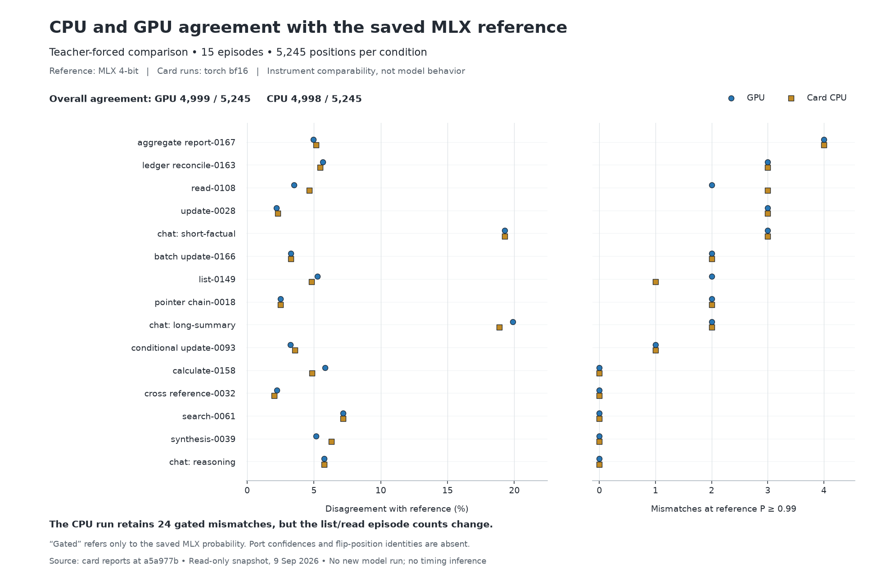

# CPU/GPU comparability snapshot

The card-CPU rerun retains **24 reference-confidence-gated mismatches**, the same
aggregate as the GPU run. Two episode counts change: `list-0149` is 2 → 1 and
`read-0108` is 2 → 3 (GPU → CPU). Equal totals do not mean identical flipped positions.

GPU agrees on **4,999/5,245** recorded positions (95.310%);
CPU agrees on **4,998/5,245** (95.291%). This is one
net agreement difference against a common reference, not a direct one-token
CPU-versus-GPU difference. The replay is teacher-forced; these are not two free-running
trajectories. No independent-sample count, interval or significance claim is made.

## Definition and limits

The producer defines a hard flip using the **MLX reference's probability ≥0.99**.
It does not test joint confidence. Neither the summaries nor their per-episode
JSONL copies store port probabilities or per-position flip identities. Therefore
this record cannot substantiate “both machines were confident” or identify which
specific positions persist. The reference is **MLX 4-bit**, while both card runs
are **torch bf16**. The CPU result weakens a GPU-only account but does not isolate
the port from precision or reference-path differences. This is instrument evidence,
not a model-behavior finding.

## Technique and data quality

Join episodes by their full label, reject duplicates, match denominators and
checkpoint/source identities, reconcile aggregate counts, and reconstruct gated
counts from the saved reference probabilities before plotting. Count differences
per episode before interpreting aggregate equality. Thirty condition-episode rows
come from fifteen distinct episodes; the two conditions are never pooled.

The four downloaded files match the SHA-256 values read on the server. Each JSONL
has a complete final line and exactly reproduces its JSON report's episode rows.
Both source heads name commit `a5a977b8cec7e32568071f7e97ff4e776f633fd4` and the same checkpoint
digest. `input_digest` is `none`; input byte identity is not independently sealed
by these heads, despite matching paths and per-episode counts. No input rows were
regenerated, and no source records or remote jobs were changed.

## Provenance and reproduction

Sources: `/workspace/wsb/out/{cuda,cpu}-all15.{json,jsonl}`, copied read-only on
2026-09-09. `source/` holds their bytes and the producer definitions from the named
commit; `analysis.json` holds hashes, bases, checks and limitations. Wall-clock and
memory values are deliberately not plotted. Chart design is in `CHART-CONTRACT.md`.

Run `analyze.py --output-dir <new-directory>` with NumPy and Matplotlib, with the
repository root and `src` on PYTHONPATH. It refuses changed source hashes and
existing output files. No model library may be imported. Tested versions:
Matplotlib 3.11.1, NumPy 2.5.3. A separate manifest
records the WS-D native-capture check and its declared one-row budget departure;
that in-flight comparison is not included in this chart.

