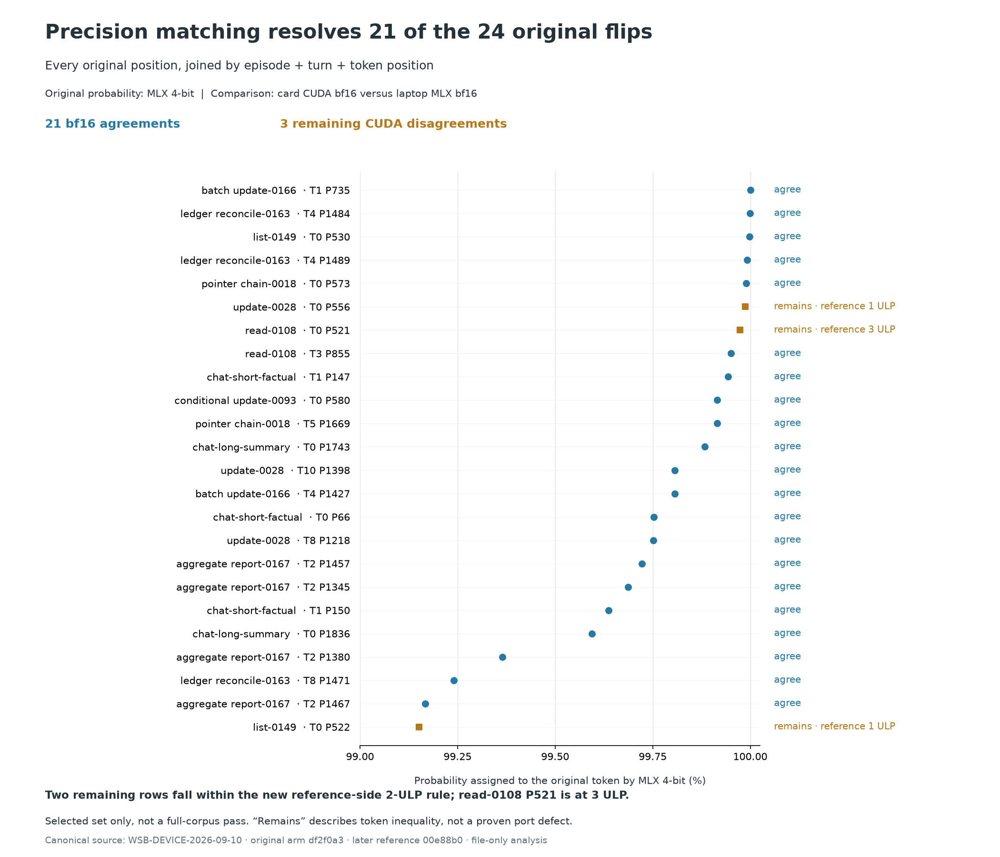
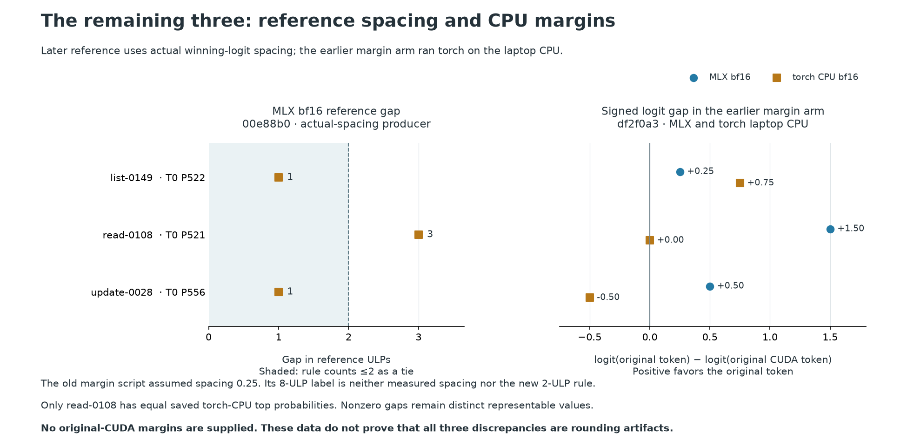

# Which original flips survive precision matching?

**Twenty-one of the original 24 disappear:** laptop MLX bf16 selects the card CUDA bf16 token, while the old MLX 4-bit token is the outlier. **Three remain** in that original CUDA comparison. A later MLX bf16 reference confirms the same tokens at all 24 positions and measures its gaps using the actual winning-logit spacing.

| remaining position | original 4-bit P | later MLX reference gap | reference-side ≤2 ULP rule |
|---|---:|---:|---|
| list-0149, turn 0, position 522 | 0.99150777 | 1 ULP | within tie band |
| read-0108, turn 0, position 521 | 0.99973875 | 3 ULP | outside tie band |
| update-0028, turn 0, position 556 | 0.99987268 | 1 ULP | within tie band |

These are **two policy-defined ties and one remaining position outside that band**, not a completed acceptance verdict. No new card acceptance run is represented here. In particular, “outside” does not itself prove a port defect: original-CUDA margins are missing, and cross-framework numerical error has not been bounded by these records.

## What the margin evidence does and does not say

The original three-position margin arm ran torch on the **laptop CPU**, as the canonical README states. Its top1 agrees with MLX at list-0149; at read-0108 the saved torch top probabilities are exactly equal; at update-0028 the frameworks favor opposite candidates by about 0.5 logit. These CPU readings are not CUDA margins.

The producer at df2f0a3 divides every recovered gap by `bf16_ulp(32.0)`, giving 0.25, without retaining the actual logits. Its MLX readings of approximately 1, 6 and 2 ULP therefore use an **assumed scale**. The later producer at 00e88b0 uses `gap / bf16_ulp(best)` and reports **1, 3 and 1** for the same three positions. Same gaps, different spacing at two positions. The later record directly demonstrates why checking that gaps are multiples of 0.25 did not verify the original assumption.

The earlier report also used an eight-ULP cutoff, while the Chief's subsequent rule names **two ULPs on the reference side**. Those conventions cannot be substituted. Finite nonzero gaps spanning several representable values are not exact ties; a chosen near-tie band is an operational tolerance, not proof of harmless rounding. The probability-ratio calculation recovers logit differences approximately from finite-precision probabilities, not exactly in real arithmetic.

## Finding, technique and implementation

**Finding:** the confident-flip rule fired mostly on a change of precision. At 21 selected positions both bf16 readings agree and the 4-bit reference dissents, including batch_update-0166 T1 P735 at recorded P=0.9999998807907104. These data support rebuilding a precision-matched reference. They do not establish that all three residual disagreements are rounding artifacts or certify the port globally.

**Technique:** freeze the original selection; join on episode, turn and absolute token position; require the original tokens and probabilities to match exactly; recompute agreement from token IDs; preserve the device used for every later margin. Measure spacing from the actual stored values, distinguish an exact tie from a chosen tolerance, and apply the stated tolerance to the specified reference. This procedure transfers across frameworks without relying on a particular model or our implementation.

**Implementation:** `analyze.py` rejects changed source and manifest hashes and model imports. It checks complete JSONL and equality with the JSON summaries, unique/full joins, the canonical CUDA recapture's exact 24-position set, all source classifications, full-reference totals and all probability-ratio reductions. Producer labels such as `port` are retained as source fields but are not adopted as causal verdicts. `joined.csv` has all original probabilities and token IDs; `margins.csv` keeps signed CPU gaps separate from actual-spacing MLX reference gaps.

## Sources, bases and limits

The canonical source is **`research/records/WSB-DEVICE-2026-09-10/`**, not the rental filesystem. The original CUDA summaries came from `/workspace/wsb/out/`; the preserved canonical record survives the rental. `SOURCES.json` pins each file to df2f0a3 (original selection, matched arm and margin arm) or 00e88b0 (the later full MLX reference and its producer) and records SHA-256. Sources are copied directly from those Git objects. This new directory supplements the approved `GPU-COMPARABILITY-2026-09-09-0955Z` record, which remains unchanged: position IDs absent from that earlier snapshot are present in the later canonical evidence.

Original confidence is **laptop MLX 4-bit**; original produced tokens are **card CUDA bf16**; matched outcomes and later reference gaps are **laptop MLX bf16**; the auxiliary torch margins are **laptop CPU bf16**. Derived comparisons combine those explicitly identified readings, never their timing or memory. Reports declare checkpoint paths but the new MLX reports omit complete checkpoint/input digests and raw logits. Hashes seal the provided files, not execution metadata they did not retain.

The 24 were selected because the old reference was confident and CUDA disagreed. They cannot estimate whole-corpus precision-matched agreement or prove all confident positions are safe. The full reference is read for identity and gap checks, not treated as a new CUDA result. The original gate's failure remains part of the record; rebasing and a later acceptance verdict belong to SWE-1 and the Chief.

## Reproduction

Run `analyze.py --output-dir <fresh-directory>` with Matplotlib and the standard library. It reads its own immutable sources, refuses existing outputs, and needs no repository imports or model libraries. Plot environment: Matplotlib 3.11.1, installed separately from the shared research environment. The script writes this README, both figures (PNG/SVG), CSVs and analysis JSON. `verify.py` tests the joins with corrupted copies and compares a fresh reproduction byte for byte.
