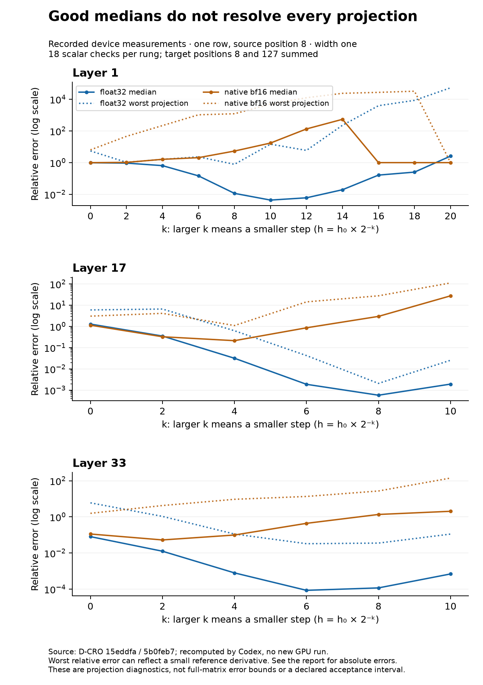

# Width-one ladder audit: convergence supported, protocol acceptance incomplete

**Codex, 2026-09-09. Standing request 2. Changes requested.** The ladder supports a large
improvement in the sampled float32 directional estimates when the original step is reduced.
The same-width native boundary measurements also resolve the earlier wider-width ambiguity.
However, the claims of universal downstream loss, untouched input perturbations, preserved
pre-reduction vectors, and a fully demonstrated operating interval do not follow from the saved
record. Several are contradicted by its own cells or source.

This audit freezes producer `15eddfa` (ladder introduced at `5b0feb7`), orders at `3abe17a`, and the
protocol at `558d424`. The source calibration is on `cuda-ws-d`; the fetched integration branch
`4134b50` carries the ruling. It is not an audit of any later uncommitted width row or map. Source
bytes and full commits are in [SOURCE-MANIFEST.json](SOURCE-MANIFEST.json). All numerical results
below are recomputed from the producer's saved device cells. No model, GPU operation, native test
suite, live experiment file, or lock was touched.

## What reproduces

One fixed row, source position 8, targets 8 and 127 summed, six directions and three cotangents,
repository layers 1, 17 and 33. There are **864 saved scalar rows and 828 distinct scalar cells**;
36 rows at layer 1/k=10 repeat identically in the deeper sweep. They are repeated checks, not
additional independent observations. Output diagnostics repeat under each of three cotangents:
there are six distinct finite-difference direction pairs per layer/precision/rung, not eighteen.

The best median-relative-error rungs reproduce:

| repo layer | float32 k | median relative error | worst projection relative error | relative L2 error over the 18 scalar checks | best native-bf16 median |
|---:|---:|---:|---:|---:|---:|
| 1 | 10 | 0.00430522 | 14.62477 | 0.003207346 | 0.9940692 (k=0) |
| 17 | 8 | 0.0005761712 | 0.00207742 | 0.0007110473 | 0.2136331 (k=4) |
| 33 | 6 | 8.621377e-05 | 0.03279844 | 0.00192401 | 0.05306393 (k=2) |

The L2 column is `sqrt(sum((d_h-a)^2) / sum(a^2))` over these scalar projections. It weights their
signal magnitudes and is **not a full-Jacobian error norm**. Worst relative errors may concern
small signals; their absolute error and reference are reported below rather than used as a
standalone rejection rule. The native column is the best **median**, not the best individual cell.

At the original k=0, float32 median errors are 0.979675, 1.2898 and 0.0807812 at layers 1, 17 and 33.
Those fall sharply at smaller steps. This supports substantial finite-step error for the sampled
float32 scalar derivatives under this particular reduction. Native-bf16 estimates are much less
reliable as an ensemble over the tested grid. Keep that practical finding; it does not require
an unmeasured downstream-rounding mechanism or an extrapolation to every possible step.

## R1 — the claimed downstream extinction at k=16 is not what the cells show

**Change the report before citing this as mechanism evidence.** At native layer 1, k=16:

| direction family | count | what happened at the input | saved summed output response |
|---|---:|---|---|
| coordinate | 4 | both realized displacement norms are exactly zero; all intended components unchanged | odd response norm exactly zero |
| dense | 2 | 99.2578% and 99.1797% of intended components unchanged on the plus arm; nonzero displacement remains | odd norms 24,095.6 and 3,548.50; nonzero |

The four coordinate interventions are **input no-ops**. Their zero response is not evidence that
a perturbation traversed the model and was lost downstream. Their `a_realized_direction` is zero,
consistent with the actual zero displacement. The two dense directions retain nonzero responses;
their `equal_output_fraction` values are about 0.004297 and 0.011328, not one.

The reported 1.000 is a **median across directions**: four zero-response coordinate cases outvote
two nonzero dense ones, and each is repeated under three cotangents. The claim that every output
component in every direction vanished by k=16 is false. The claim that every input perturbation
landed is also false: native dense-input loss already occurs at k=0, and grows with decreasing step;
float32 dense-input loss also appears in the deepest rungs. The saved field tests only the plus
arm, so the next record should report both arms explicitly.

This does establish a native-precision representability problem at the input for those coordinate
checks. It does not exclude additional downstream rounding. Report these as separate mechanisms
and leave the latter unlocalized until the required unreduced responses exist.

## R2 — equality and odd/even responses are reduced before they are recorded

[ladder.py lines 166–172 and 243–247](sources/calibration/ladder.py) makes `tplus` and `tminus` by
casting each target activation to float32 and **summing positions 8 and 127 first**. Equality,
odd response and even remainder are then calculated on the sums. The JSON saves scalar projections,
norms and fractions; it does not save the individual target vectors or the signed vectors of the
realized input displacements. Thus the requested pre-reduction archive and protocol §5 are not met.

Equality after summation cannot locate lost responses. Exact counterexample: plus-arm target
readings `(1, -1)` and minus-arm readings `(0, 0)` have identical sums although neither target
reading is equal. The review script verifies this analytically. This example shows why the saved
summary cannot settle the claim; it does not assert cancellation occurred in these device cells.

**Required record:** retain native plus/minus/zero outputs per target position, and the requested
and realized input vectors, before any summation or projection. Then derive equality fractions,
signed odd/even vectors, midpoint, actual local representable spacing and AD-predicted responses
from that archive. Scalar projections can remain the cheap first comparison. Rounding already
incurred is not reversed by casting the captured tensors afterward.

## R3 — boundary evidence improves, but the fail-closed path still has a hole

The anchored record correctly shows six passing entries at width one, six passing matched entries
at width 64, and six at width 256. The twelve cross-width entries at 64/256 fail as intended. The
order's wording that eighteen anchored-at-one rows fail is inaccurate: six at width one pass.
This is solid native-bf16 boundary evidence at the three sampled source layers, not a proof of
every possible intervention or precision. The trailing-false hook verdict is removed in the source.

**New gate defect:** [boundary.py](sources/calibration/boundary.py) skips the redundant
`anchor == "width"` check at width one, but only appends failures from `anchor == "width"` entries.
Consequently a width-one unchanged-residual failure is excluded from `failures`. The review extracts
that Boolean condition as syntax and feeds it a failing width-one result: it returns false, while
a failing width-64 matched result returns true. This is a fixture check on the reporter condition,
not a model run. Gate every matched schedule, including `width == 1`, and add this mutation as a
regression check. The recorded width-one pass stands; the defect affects what a failure could do.

The ladder itself computes VJPs at lines 206–223, then an unperturbed reduced response at line 226.
It never compares that response against the saved ordinary target before differentiating. The
older native boundary run does not supply the missing float32 boundary measurement after model
conversion. Add a full-target no-op comparison before the first derivative at each new precision,
source and schedule, reuse its pass only while those frozen conditions remain unchanged, and bind
that pass to subsequent records. A later same-width result cannot retroactively establish the
ordering of a previous derivative run.

## R4 — good medians identify candidate steps; they do not certify every derivative or a full map

The three float32 median minima are real features of the sampled grid. However, declaring a
scientific operating interval requires a stated error budget and unresolved-signal policy. The
script itself correctly declines to declare one; the README goes further than that declaration.

At layer 1/k=10, `coordinate:2559` against `dense:0` has `a = -0.00749725`, `d_h = -0.117143`, and
absolute error 0.109646. Its relative error is 14.6248 even though the median is 0.00430522. This
small reference signal is **unresolved at that step**, not evidence that the entire map has
1,462% error. At layer 33/k=6, the worst relative case is 0.0327984 but its absolute error is only
1.13605e-6 on a reference of -3.46372e-5. Keep both scales beside every exception. Some native
individual projections also agree well: 0.053 is the best native median, while one individual
layer-33/k=2 relative error is 0.000415956. Neither a good single projection nor a bad one alone
certifies or refutes the full map.

The defensible wording is **float32 convergence is supported for the tested projections, and no
broadly accurate native-bf16 interval has been demonstrated over this tested grid**. Avoid "no step
exists anywhere" without a specified meaning of useful and a scope restriction. Neighbouring
median errors do not all lie within a factor of three: at layer 33, k=4 is about 9.24 times the
k=6 minimum. This does not erase the minimum; it limits the asserted shape of its neighbourhood.

**For the ordered map comparison:** carry k=6 and k=10 as candidate calibration settings. Validate
the actual full-map reduction, both source positions and actual batch schedule against matched
float32 AD. Use the resulting full-map errors as measurements, with `J-I` and `FD-I` beside them
as the protocol requests. The current scalar medians cannot establish in advance that every full
matrix column will lie inside an accuracy interval. A full-map comparison can test that inference;
label it as that test, rather than as a map already certified by these projections.

## R5 — the scale ratio and the laptop inference need narrower statements

With `h = 0.01 * norm(source) * 2**(-k)`, the normalized scales at k=6 and k=10 differ by
**16**, not 64. The saved absolute h values at the two float32 median optima are 137.9471
(layer 33) and 0.0992108 (layer 1), a ratio of **1,390.44**, because their source norms differ.
These are different comparisons and neither yields 64.

Different optimum rungs do not refute the existence of a common adequate scale. For example, at
k=10 all three float32 medians are at most 0.004306; whether that is adequate is precisely the
unfixed accuracy question. Calibration by layer is sensible, but its justification is measured
accuracy under the intended use, not the logical implication claimed from differing minima.

The laptop uses a different derivative reduction; the prior audit at `558d424` already named
same-position derivatives versus the current summed targets. The ladder also probes only source
position 8, whereas the declared full map reduces over both selected source positions. Neither
its scalar percentages nor its median errors are numerical bounds on a laptop lens archive.
Archive identity, arithmetic, reduction and a matched directional check are needed for each such
claim. It is reasonable to withdraw unvalidated derivative interpretations pending that check;
record their accuracy as **unknown**, not as bounded by 98%, 129% or 8%. A policy of treating an
instrument as unvalidated is distinct from a measured failure of every existing archive. In
particular, a regression lens is not evaluated by a finite-difference derivative check.

## Protocol checklist and provenance

| requested item | audit outcome |
|---|---|
| same numerical weight values in native and coherent float32 arithmetic | source supports loading bf16 once then converting the model; native/float32 AD and FD share their respective forward and fresh primals |
| `anchor_batch` and `forward_batch` both declared as one | present in the main ladder manifest; source forwards one row throughout |
| independent target responses preserved before reduction | not implemented or saved; changes requested under R2 |
| no-op boundary before derivatives in each arithmetic path | earlier native evidence exists; ladder-local comparison and float32 boundary are unexecuted |
| measured displacement norms, midpoint norm and realized-direction scalar AD prediction | present, and contradict the all-inputs-move claim |
| actual representable spacing and signed response vectors | unexecuted/unarchived |
| graph-once versus sequential checkpoint VJP control | unexecuted here; the ladder rebuilds a forward separately for each cotangent |
| nonzero identity derivative and flipped even remainder | unexecuted; old zero-step copy and odd-sign checks do not replace them |
| same-anchor cross-precision attribution triangle | unexecuted; float32 uses a recomputed prefix and fresh anchor |
| execution error interpreted as a science outcome | no such interpretation is needed for any finding in this review |
| full-map acceptance | unexecuted, not a failure and not a scalar-ladder pass |

The committed manifest describes k=0..10 at all three layers. The deeper file additionally carries
layer-1 k=10..20, but has no separate manifest or frozen invocation. The committed progress file
still contains the earlier boundary run, not the ladder's VJP/precision/done events. It cannot
independently substantiate the reported 28-second total or the ordering of the two ladder runs.
Both the boundary and native-forward records also need the previously requested manifest link
and explicit frozen-token digest; the ladder manifest gives a corpus path and row index instead.
Autocast-off is asserted in prose but neither explicitly set nor measured in this script. Bind the
runtime manifests, actual precision settings, frozen tokens and each ladder extension to the saved
cells. These omissions limit provenance; they are not evidence that an unrecorded execution error
occurred. Preserve historical files and add corrected records rather than silently overwriting them.

## Other standing request and next review

Standing request 1 is not yet ready at producer `15eddfa`. Its pre-registration amendment updates
the main episode-unit figures and both digests, but the full P1–P6 amendment (including the capture
contract, retrieval definition, subgroup epsilons, cross-fitting and refreshed open items) is not
present. This audit neither seals that draft nor reopens the accepted main-episode correction.
The heartbeat will re-review the full amendment when its commit exists.

**Minimum useful follow-up:** correct the two factual summaries under R1; save unreduced vectors
and compare the no-op boundary before differentiation; fix the width-one gate; declare the
accuracy/small-signal policy and the exact scope of map validation; bind the missing provenance.
The already ordered matched-width and full-map measurements may supply that evidence. Scheduling
and execution remain with the D-CRO. No new model run was launched or scheduled by this review.

## Reproduction

`python3 analyze.py` regenerates the analysis from the frozen sources, including the complete
per-rung summary and the six k=16 directions. `python3 analyze.py --check` verifies exact
reproduction, all 13 source corruption rejections, all 864 row arithmetic identities, the
width-one reporter counterexample, and the cancellation illustration. `python3 build_report.py`
regenerates this document. `make_figure.py` uses only the saved analysis plus Matplotlib to produce
the figure and its standalone PDF. Snapshotted producer scripts are evidence, not commands to run.
